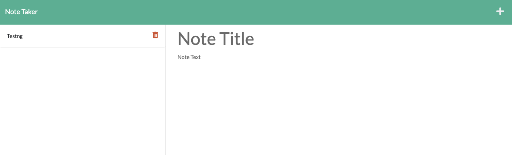

# Express-note-taker

## Table of Contents
- [Project Description](#Description)
- [Demo](#Demo)
- [Credits](#Credits)
- [Extra Info](#Info)

## Deployed Application
The deployed Heroku application can be found at: https://serene-sands-59379.herokuapp.com/

## Description
The purpose of this project is to provide the client with a note taking application which is able to use a server to store persistent data that is input at the client-side via a html page.  The application successfully allows users to write and store data to the back-end database, but the server needs to be restarted in order to view the stored 'note' at the client-side.

## Demo

# Credits
Third Party services used:
- Heroku : https://dashboard.heroku.com/apps
- Express.js: https://expressjs.com/
- npm inquirer: https://www.npmjs.com/package/inquirer

Resources accessed:
- AskBCS Learning Assistant
- MDN docs: https://developer.mozilla.org/en-US/
- Stack Overflow: https://stackoverflow.com/

# Extra Info
- This assignment was difficult due to being provided a started code which was not supposed to be altered. The main challenge faced was being able to fully comprehend the index.js code in order to creata a server.js script to effectively communitate with it. 

- The note-storing function on the /notes page is get to be fixed as the server needs to be restarted in order to view the note that has just been saved (this does not happen instantaneously). AskBCS was consulted to see how this could be fixed without altering the index.js started code but no solution was able to be found. 

